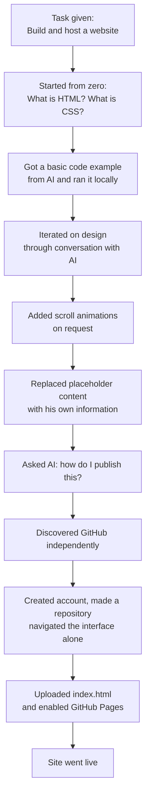

# Ayush's First Website

---

## What is this?

This is a personal profile website built by my younger brother, Ayush Sokande — an 8th standard student with absolutely zero prior coding experience.

He had never opened a code editor. He did not know what HTML was. He had never heard of GitHub. He knew what a website looked like from the outside, and that was the extent of it.

I gave him one task: **build a website and host it online so I can open it from anywhere.**

No stack was suggested. No tools were recommended. No tutorial was shared. He used an AI assistant(ChatGPT) and figured out the rest entirely on his own — including discovering GitHub, understanding what repositories are, uploading his file, and enabling GitHub Pages to make it live.

This repository is the result.

---

## What the site contains

A simple personal profile page for Ayush with the following sections:

- **Education** — Sacred Heart School, Kalyan Varap, Maharashtra
- **About Me** — Class topper, focused on learning
- **Hobbies** — Cricket
- **Skills** — Strong memory and quick retention
- **Projects** — Coming Soon

Each section animates into view as you scroll down the page.

---

## How the journey went

---

## What AI got right

- Explained concepts from zero — HTML, CSS, the difference between them, how to combine them into one file
- Responded well to vague requests like *"make it more designed"* and produced progressively better results
- Walked him through GitHub step by step when he got confused, even when his descriptions of what he was seeing were unclear

## What AI got wrong

- Kept referencing images in responses that were not useful or accurate
- At one point gave him a wrong school name ("Insected School") — he had to correct it himself
- Sometimes added unnecessary complexity that confused a beginner
- Gave answers assuming more context than he had — he had to keep asking follow-up questions to understand what to actually do

---

## The real point

AI did not build this website. It answered questions. Ayush built it — by asking the right follow-ups, figuring out what to do with the answers, navigating GitHub alone when it confused him, and seeing it through from a blank page to a live URL.

That is not a small thing for someone who had never written a line of code.

---

*README written by Sujal Sokande — Ayush's elder brother.*
